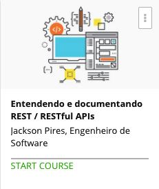

```
Roberto Nogueira  
BSd EE, MSd CE
Solution Integrator Experienced - Certified by Ericsson
```
# Udemy Restful APIs



**About **

Learn everything you need to about the subject of this `Udemy` project.

[Homepage](https://www.udemy.com/restful-apis/learn/v4/content)

## Topics
```
Section: 1
0 / 41
Entendendo os conceitos que permeiam as RESTful APIs
[ ] 1. Introdução 1:21
[ ] 2. O que é uma API Application? 4:54
[ ] 3. Resource, URI, URL, URN, IRI 9:07
[ ] Quiz 1: Exercícios - Aulas 02 e 03 0:00
[ ] 4. O que é REST 10:40
[ ] 5. REST vs RESTful / Reprensentações 3:54
[ ] 6. REST vs SOAP 2:37
[ ] Quiz 2: Exercícios - Aulas 04, 05 e 06 0:00
[ ] 7. cURL 11:49
[ ] 8. Analisando uma resposta HTTP 9:28
[ ] Quiz 3: Exercícios - Aulas 07 e 08 0:00
[ ] 9. Métodos HTTP / Verbos - Parte 1/2 15:20
[ ] 10. Métodos HTTP / Verbos - Parte 2/2 13:34
[ ] 11. Safe Methods e Métodos Idempotentes 3:40
[ ] Quiz 4: Exercícios - Aulas 09, 10 e 11 0:00
[ ] 12. Modelo de Maturidade Richardson - Parte 1/3 7:48
[ ] 13. Modelo de Maturidade Richardson - Parte 2/3 7:47
[ ] 14. Modelo de Maturidade Richardson - Parte 3/3 5:24
[ ] Quiz 5: Exercícios - Aulas 12, 13 e 14 0:00
[ ] 15. Outras ferramentas 4:39
[ ] 16. Media Types 7:53
[ ] Quiz 6: Exercícios - Aulas 15 e 16 0:00
[ ] 17. Gerindo Erros 6:43
[ ] 18. Gerindo Erros (Exemplos) 10:04
[ ] Quiz 7: Exercícios - Aulas 17 e 18 0:00
[ ] 19. Versionamento 4:26
[ ] Quiz 8: Exercícios - Aula 19 0:00
[ ] 20. Caching 5:54
[ ] 21. Cache no Cliente 8:37
[ ] 22. ETag 12:12
[ ] 23. Cache com diferentes tipos de representação 4:58
[ ] Quiz 9: Exercícios - Aulas 20 a 23 0:00
[ ] 24. Autenticação 6:43
[ ] 25. Identificação x Autenticação x Autorização 2:53
[ ] 26. Autenticação com HTTP 5:57
[ ] 27. Autenticação com HTTP (Exemplo) 3:30
[ ] 28. Autenticação baseada em Token 6:12
[ ] 29. Stateless Authentication (com OAuth) 8:27
[ ] 30. JWT - JSON Web Tokens 14:21
[ ] 31. JWT - JSON Web Tokens (Exemplo) 7:25
[ ] Quiz 10: Exercícios - Aulas 24 a 31 0:00

Section: 2
0 / 15
Projetando e Documentando nossa primeira API RESTful
[x] 32. Conhecendo o Swagger.io 2:04
[x] 33. Swagger Editor 3:23
[x] 34. Projetando nossa 1a API 2:05
[x] 35. Primeiros Passos 9:35
[x] 36. Definitions Object 5:53
[x] 37. Primeiro Path 7:47
[x] 38. Read com parâmetro 4:51
[x] 39. Create path 6:55
[ ] 40. Put/Patch path 3:24
[ ] 41. Delete path 3:45
[ ] 42. REST? RESTful? 2:33
[ ] 43. Gerando Código 2:11
[ ] 44. Gerando a documentação 0:57
[ ] 45. Recomendação (JSON:API Specification) 2:36
[ ] 46. Finalização 0:40
```
